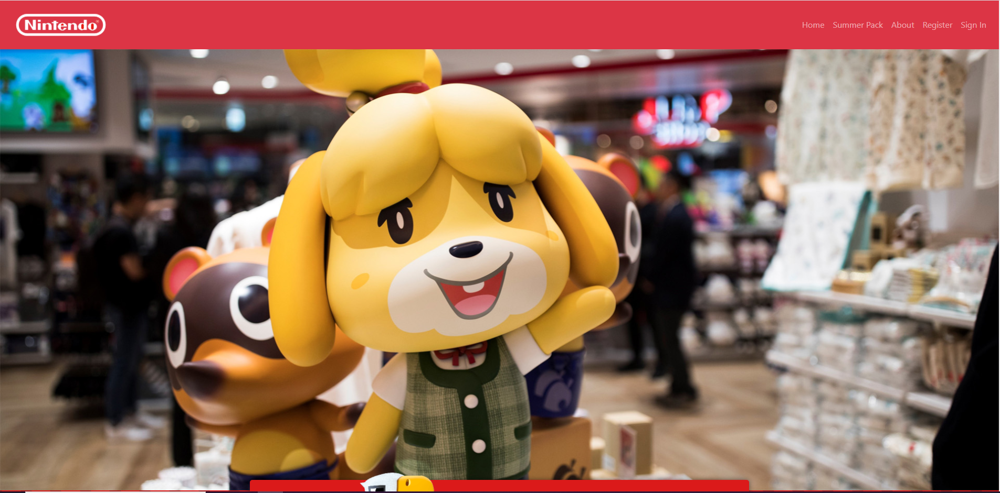

# Sitio web creado con Bootstrap 5

## Instrucciones para ejecutar el sitio web

Clona el proyecto en tu computadora

`git clone https://github.com/AraqueGD/WebSite_Bootstrap5.git`

Para poder ejecutar el sitio web abre el archivo en cualquier Navegador `index.html`.

Para trabajar con los archivos iniciales te recomiendo la extensión de [Live Server](https://marketplace.visualstudio.com/items?itemName=ritwickdey.LiveServer#:~:text=%20Shortcuts%20to%20Start%2FStop%20Server%20%201%20Open,to%20Stop%20the%20server%20%28You%20can...%20More%20)

# Author

- Camilo Araque <https://github.com/AraqueGD>
